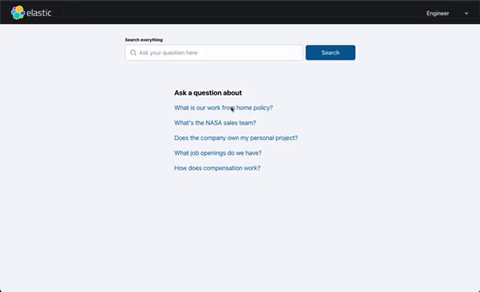

# Elastic Workplace Sample App

This is a sample app that combines Elasticsearch and OpenAI to create a semantic search experience.



## 1. Download the Project

Download the project from Github and extract the python-flask-example folder.

```bash
curl https://codeload.github.com/elastic/elasticsearch-labs/tar.gz/main | \
tar -xz --strip=2 elasticsearch-labs-main/esre-examples/python-flask-example
```

## 2. Index Data

You can index the data from the provided .json files by following the [README](./example-data/README.md) instructions in the `example-data` folder. At the moment indexing your own data should be possible. The UI will attempt to use the URL in the data file for the HTML link to the source.

### Loading your own data

See the [medicare](./example-data/README.md#loading-custom-data) example in the example-data folder for loding your own data.

## 3. Credentials

Requires the following environment variables to be set. This can be done by creating a `.env` file in the `/api` directory of the project.

### Setup with OpenAI

You can get your OpenAI key from the [OpenAI dashboard](https://platform.openai.com/account/api-keys).

```
openai_type=openai
openai_api_model="gpt-3.5-turbo-0613"
openai_api_key=<your-openai-key>
cloud_id=<elasticsearch-cloud-id>
cloud_pass=<elasticsearch-password>
cloud_user=<elasticsearch-user>
```

### Setup with Azure OpenAI Credentials

You can get your Azure OpenAI key from the [Azure OpenAI dashboard](https://ms.portal.azure.com/#blade/Microsoft_Azure_Marketplace/GalleryFeaturedMenuItemBlade/selectedMenuItemId/home/searchQuery/openai/resetMenuId/).

```
openai_type=azure
openai_api_key=<your openai api key>
openai_api_type=azure
openai_api_base=<your openai api base url>
openai_api_version=2023-03-15-preview
openai_api_engine=<your openai api engine>
cloud_id=<elasticsearch-cloud-id>
cloud_pass=<elasticsearch-password>
cloud_user=<elasticsearch-user>
```

## Developing

With the environment variables set, you can run the following commands to start the server and frontend.

### Pre-requisites

- Python 3.8+
- Node 14+

### Install the dependencies

```
cd api && pip3 install -r requirements.txt
cd frontend && yarn
```

### Run API and frontend

```
cd api && python3 app.py

# in a separate terminal

cd frontend && yarn start
```

You can now access the frontend at http://localhost:3000. Changes are automatically reloaded.

## Running the Docker container

```
docker build -f Dockerfile -t python-flask-example .
docker run -p 4000:4000 -d python-flask-example
```
